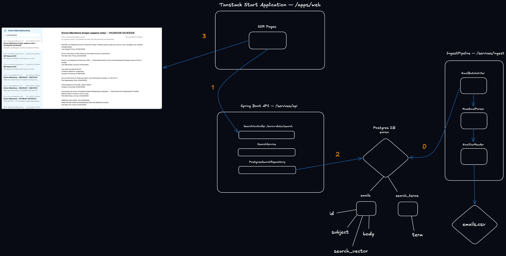

# Enron Email Search

[Energetica](https://energetica.io/) technical challenge — a search tool for the Enron email dataset. The PoC system acts allows typing keywords (with possible mispellings) and get back matching emails.

## Demo

[Watch the loom walkthrough]()

## Technology

### Frontend

- React
- TanStack Start SSR
- TypeScript
- Tailwind
- shadcn/ui

### Backend

- Kotlin
- Postgresql
    - Full-text search (tsvector / tsquery)
    - pg_trgm for fuzzy term matching
- Spring Boot
- JDBC

### Infrastructure

- Docker Compose

## Running Locally

### Prerequisites

- Java 21
- Docker
- Bun

### Running

1. Start PostgreSQL:

```
docker compose up -d postgres
```

2. Ingest the dataset:

Download and place [the Kaggle emails.csv](https://www.kaggle.com/datasets/wcukierski/enron-email-dataset/data) file at `services/ingest/emails.csv`.

Alternatively, set INGEST_CSV to the location of the file.

Run the ingestion job:

```
./gradlew :services:ingest:run
```

The ingestion process reads the CSV as a stream, parses each MIME message, and writes the emails to PostgreSQL in bounded batches. The process exits once ingestion is complete. This took a few minutes on my M3 mac.

The ingestion task runs with a 256 MB JVM heap to satisfy the challenge constraint.

3. Start the API

```
./gradlew :services:api:bootRun
```

The API runs on port 8080.

4. Start the frontend

```
cd apps/web
bun install
bun run dev
```

The frontend runs on port 3000 and connects to the API at http://localhost:8080 by default.

## Technical Overview

The system separates ingest from search, as shown in the following diagram:



### Ingest

[The Kaggle dataset](https://www.kaggle.com/datasets/wcukierski/enron-email-dataset/data) is a CSV containning columns `file` and `message`, where `message` is the original MIME email.

The CSV is processed as a stream by `EmailCsvReader`. Each record is then parsed as MIME by `MimeEmailParser` and written to PostgreSQL by `EmailBatchWriter` as part of a batch. The `file` value is used as the email identifier.

### Full-text search

PostgreSQL's full-text search is used for document retrieval.

A generated tsvector is stored for each email and indexed using GIN. The subject and body are indexed with different weights so that matches in the subject contribute more strongly to the result rank.

The simple text-search configuration is used rather than English stemming. This keeps terms such as names, project names and other domain-specific words intact.

Search ranking uses PostgreSQL's ts_rank_cd.

### Misspelling handling

Misspellings are resolved before searching the email corpus.

The system maintains a search_terms vocabulary containing terms extracted from the indexed text. When a search term is received:

An exact vocabulary match is preferred.
For terms of at least four characters, pg_trgm is used to find a sufficiently similar vocabulary term.
If no suitable term can be found, the term does not contribute to the search.

This keeps fuzzy matching restricted to the vocabulary rather than performing trigram matching across the email bodies.

For example:

contrcat -> search_terms -> contract -> full-text search

The fuzzy-match threshold is currently 0.35.

### Search expressions

The search input is parsed into a small expression tree containing:

Term
And
Or

Plain keywords are treated as an AND expression:

gas contract

is equivalent to:

gas AND contract

AND binds more tightly than OR:

gas OR oil AND contract

is interpreted as:

gas OR (oil AND contract)

The resulting expression is compiled into a parameterized PostgreSQL tsquery.

### Result deduplication

The same message is often stored in more than one folder of a mailbox, with a different file id and a different generated Message-ID for each copy.

Ingest keeps one row per mailbox and message. The key hashes the mailbox, sender, date, subject, and body. The first copy in the CSV is inserted, and later copies are skipped. A message filed under two employees is kept for each mailbox.

When stored rows still share a Message-ID, search keeps the highest-ranked one.

## Handling Larger Datasets

The current implementation is designed around the Kaggle dataset and the 256MB JVM heap constraint.

The ingestion process loads bounded batches from the CSV into memory.

The API delegates search to PostgreSQL's indexes.

For a substantially larger, the same separation between raw data, indexing and query handling provides a basis for scaling the system.

The main limitation would eventually become the size and operational requirements of the PostgreSQL database and its indexes. The search index and underlying email storage could be distributed across multiple nodes.

Alternative solutions such as Lucene, OpenSearch and ElasticSearch could also be considered for larger datasets.

## Scope Decisions

The implementation focuses on the core requirements of the challenge:

- Streaming ingestion of the supplied CSV dataset.
- MIME email parsing.
- PostgreSQL-backed full-text search.
- Misspelling resolution using pg_trgm.
- Keyword searches in any order.
- AND / OR search expressions.
- Ranked search results.
- Deduplication of repeated copies of the same email.
- A REST API and simple search UI.

The following are intentionally outside the current scope:

- Related or neighbouring emails.
- Email attachments.
- Phrase and proximity searches.
- Highlighted search snippets.
- Stemming and synonym support.
- Resumable ingestion.
- Distributed search.
- Authentication and authorisation.
- Advanced result pagination.

These could be added independently without changing the basic separation between ingestion, search parsing, term resolution and document retrieval.

## Testing

The test suite covers the main ingestion and search behaviours, including:

- Multiline CSV fields.
- MIME extraction.
- Bounded ingestion batches.
- Duplicate vocabulary terms.
- Keyword ordering.
- AND / OR expressions.
- Search ranking.
- Misspelling resolution.
- Full-text lookup.
- Blank search validation.
- Parameterized database queries.

Run the tests with:

./gradlew test
